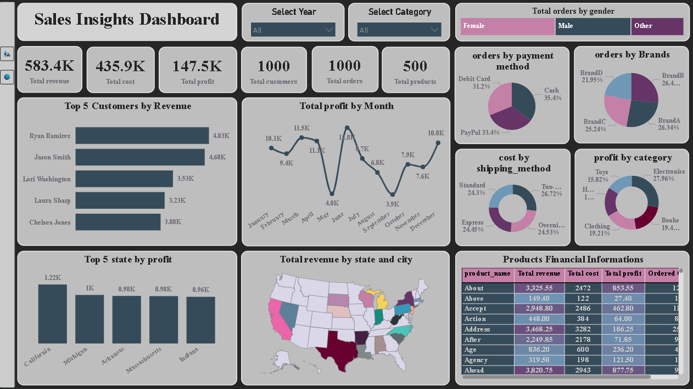

# 🧾 Sales Insights Dashboard Project

A comprehensive data analysis and visualization project aimed at uncovering key sales insights using **SQL**, **Power BI**, and **Excel**. This project helps stakeholders make informed, data-driven decisions by highlighting customer behavior, product performance, revenue trends, and more.

---
 

## 📁 Project Files

| File Name                        | Description                                           |
|----------------------------------|-------------------------------------------------------|
| `Sales_Project.sql`              | SQL queries to extract insights from sales database. |
| `Sales Insights dashboard.pbix` | Power BI dashboard for visualizing sales insights.   |

## 📊 Key Business Questions Answered

- ✅ Total number of orders, products, and customers
- ✅ Most frequently ordered products
- ✅ Average order value
- ✅ Monthly and yearly revenue trends
- ✅ Top 5 states by revenue
- ✅ Gender-wise spending distribution
- ✅ New vs. returning customers (monthly)
- ✅ Top 10 customers by lifetime value
- ✅ Customer churn prediction
- ✅ Top and underperforming products
- ✅ Average shipping time

---

## 🔍 Tools & Technologies Used

- **SQL** – Data cleaning, transformation, and complex querying
- **Power BI** – Interactive dashboards and visual analytics
- **Excel** – Data preprocessing and exploration

---

## 📈 Dashboard Highlights

The Power BI dashboard provides visual answers to the above questions through:

- Revenue & profit KPIs
- Product & customer segmentation
- Time-series analysis
- Interactive filters by state, gender, and product category
- Churn heatmaps & trendlines

---

## 🚀 How to Use

1. Open `Sales_Project.sql` in any SQL client connected to your `sales` database.
2. Run the queries to generate insights from raw data.
3. Explore `Sales Insights dashboard.pbix` in Power BI Desktop.
4. Use slicers and visuals to gain deeper business understanding.

---

## 📌 Insights Uncovered

- High-performing products and customers
- Customer retention vs. acquisition dynamics
- Revenue contribution by state and gender
- Average delivery delay impact
- Hidden trends among underperforming products

---

## 🙌 Acknowledgements

Thanks to publicly available dummy data and educational sources for enabling this case study. Ideal for learners and analysts seeking to master SQL + Power BI integration.

---

## 📫 Contact

**Mihir Limje**  
📧 [Add Your Email]  
🔗 [LinkedIn/GitHub Links if available]

